## What is Content Delivery Network?
A Content Delivery Network (CDN) is a system of distributed servers that deliver web content and other digital assets to users based on their geographic location. The primary goal of a CDN is to improve the performance, speed, and reliability of delivering content by caching it on servers that are closer to the end-users.

## How does CDN work?
When a user requests content from a website that uses a CDN, the request is routed to the nearest CDN server. This server then delivers the cached content to the user, reducing latency and improving load times. If the requested content is not available on the nearest server, the CDN retrieves it from the origin server and caches it for future requests.

## Benefits of using CDN
1. Improved Performance: By serving content from servers closer to the user, CDNs reduce latency and improve load times.
2. Scalability: CDNs can handle large amounts of traffic and sudden spikes in demand, ensuring that websites remain accessible during peak times.
3. Reliability: CDNs provide redundancy and failover capabilities, ensuring that content remains available even if one server goes down.
4. Security: CDNs can offer additional security features, such as DDoS protection and secure content delivery through HTTPS.
5. Cost Savings: By offloading traffic from the origin server, CDNs can reduce bandwidth costs and server load.

## Popular CDN Providers
- Cloudflare
- Akamai
- Amazon CloudFront
- Fastly
- Microsoft Azure CDN
- Google Cloud CDN
## Conclusion
CDNs play a crucial role in modern web infrastructure by enhancing the delivery of digital content. By leveraging a network of distributed servers, CDNs improve performance, scalability, reliability, and security for websites and applications. As internet usage continues to grow, the importance of CDNs in ensuring a seamless user experience cannot be overstated.

---
Lets look into some common Terms in CDN:
1. **Edge Server**: A server located at the edge of the network, closer to the end-users, responsible for delivering cached content.
2. **Origin Server**: The original source of the content that is being distributed through the CDN.
3. **Caching**: The process of storing copies of content on CDN servers to reduce load times and server strain.
4. **Latency**: The time it takes for a data packet to travel from the source to the destination, affecting load times.
5. **PoP (Point of Presence)**: A physical location where CDN servers are deployed to serve content to users in that area.
6. **Load Balancing**: The distribution of network traffic across multiple servers to ensure no single server becomes overwhelmed.
7. **DDoS Protection**: Security measures implemented by CDNs to protect against Distributed Denial of Service attacks, It means when you have alot of spam traffic then it will not allow all of them to your website only verified one can enter.
8. **TLS/SSL**: Protocols used to secure data transmitted over the internet, ensuring secure content delivery through HTTPS.
9. **Content Invalidation**: The process of removing or updating cached content on CDN servers to ensure users receive the most up-to-date information.
10. **Bandwidth**: The amount of data that can be transmitted over a network in a given amount of time, often measured in bits per second (bps).
---
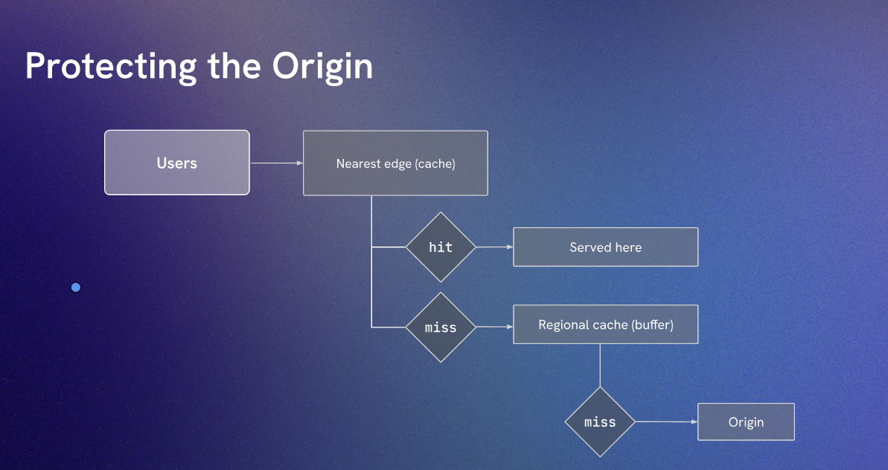
> What is cache? and why buffer matters?

- Cache is a high-speed storage layer that temporarily stores frequently accessed data to reduce the time it takes to retrieve that data. In the context of CDNs, caching involves storing copies of web content on edge servers located closer to users, which helps improve load times and reduce latency.

- Buffer, on the other hand, is a temporary storage area used to hold data while it is being transferred from one place to another. In networking and data transmission, buffers help manage differences in data processing speeds between devices or systems. They ensure smooth data flow and prevent data loss or overflow during transmission.

cost 
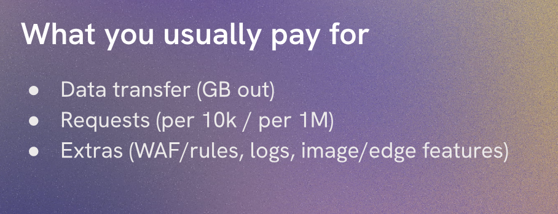

saving
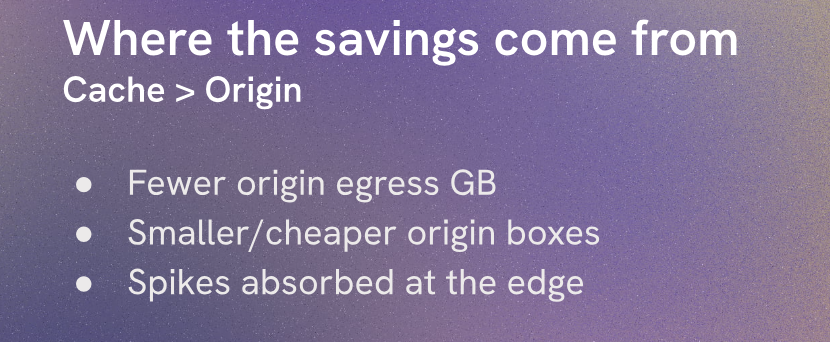

cloudflare for free personal projects
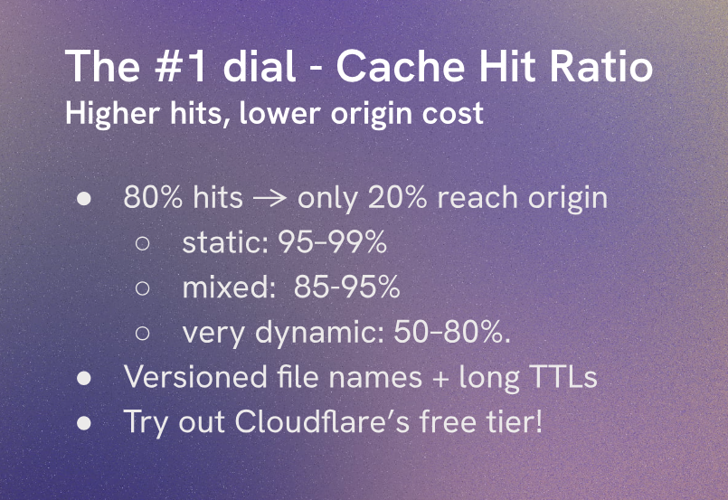

---
Edge Functions
Edge functions are small pieces of code that run on edge servers within a CDN. They allow developers to execute custom logic closer to the end-users, enabling dynamic content generation, personalization, and other advanced functionalities without the need to route requests back to the origin server.

Benefits of Edge Functions:
1. Reduced Latency: By executing code on edge servers, edge functions minimize the distance data must travel, resulting in faster response times.
2. Scalability: Edge functions can handle high volumes of requests, distributing the load across multiple edge servers.
3. Personalization: Developers can use edge functions to deliver personalized content based on user location, device type, or other criteria.
4. Offloading Origin Servers: By processing requests at the edge, edge functions reduce the load on origin servers, improving overall performance and reliability.
5. Flexibility: Edge functions can be written in various programming languages and can integrate with other services and APIs.

Use Cases of Edge Functions:
1. A/B Testing: Deliver different versions of content to users based on predefined criteria.
2. Geolocation-Based Content: Serve region-specific content based on the user's location.
3. Authentication and Authorization: Implement security checks and access controls at the edge.
4. Image Optimization: Dynamically resize and optimize images based on device capabilities.
5. API Gateway: Act as a proxy for API requests, handling rate limiting and caching at the edge.

Serverless is not equal to Edge Functions

Health checks and failover (Multiple Origins)

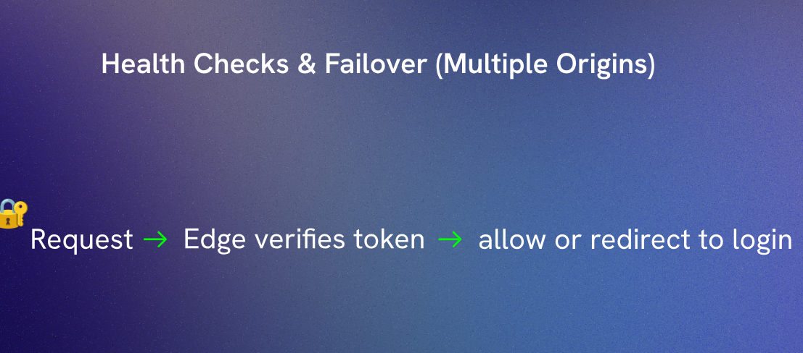

CDN drawbacks and Gotchas
1. Cache Invalidation Complexity: Managing cache invalidation can be challenging, especially for dynamic content that changes frequently.
2. Initial Setup and Configuration: Setting up a CDN and configuring it correctly can be complex and may require technical expertise.
3. Cost Considerations: While CDNs can reduce bandwidth costs, they also come with their own pricing models that may not be cost-effective for all use cases.
4. Latency Variability: Depending on the geographic distribution of users and CDN servers, latency improvements may vary.
5. Limited Control: Using a third-party CDN means relying on their infrastructure and policies, which may limit customization options.
6. Security Risks: While CDNs offer security features, they can also introduce new vulnerabilities if not configured properly.
7. SEO Implications: Improper CDN configuration can lead to duplicate content issues, affecting search engine rankings.
8. Data Privacy Concerns: Using a CDN may involve sharing user data with third-party providers, raising privacy concerns.
---

Some Secret tips:
1. Use a CDN with HTTP/2 or HTTP/3 support for better performance.
2. Leverage CDN analytics to monitor performance and user behavior.
3. If your TTL is long user might see stable content after you deploy.
- Purges are not always instant across every edge server, some takes seconds or minutes to propagate
* solution - Use short TTLs on assets that are likely to change a lot and plan a cache busting strategies like versioned file names for critical assets 
4. Optimize your origin server to work well with the CDN.
5. Test your CDN configuration regularly to ensure optimal performance and security.
6. Country based 
    - If your audience is concentrated in specific countries, choose a CDN provider with strong presence in those regions to ensure optimal performance.

> Popular CDNs

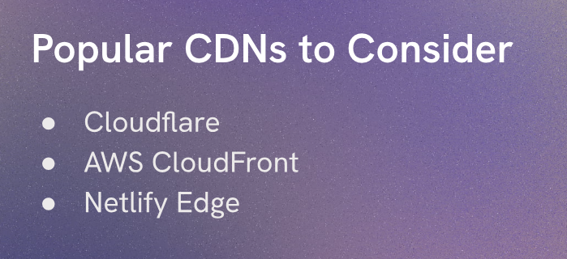

> cloudflare provider

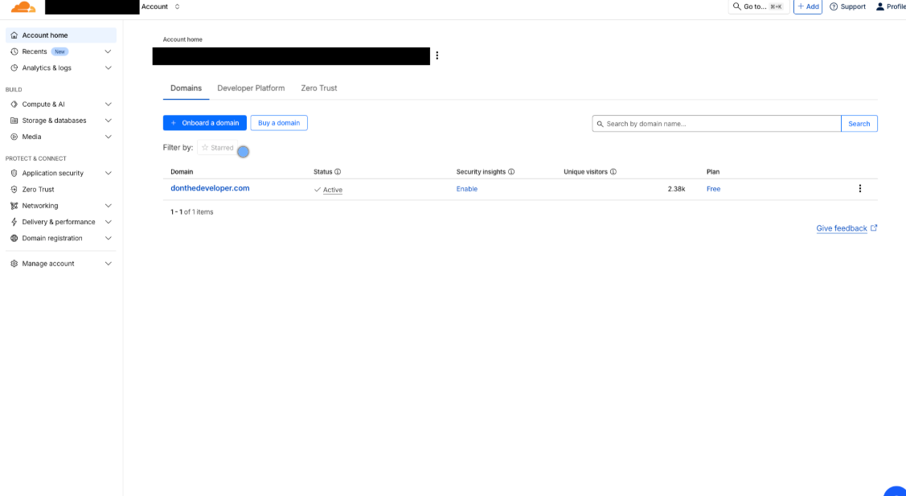
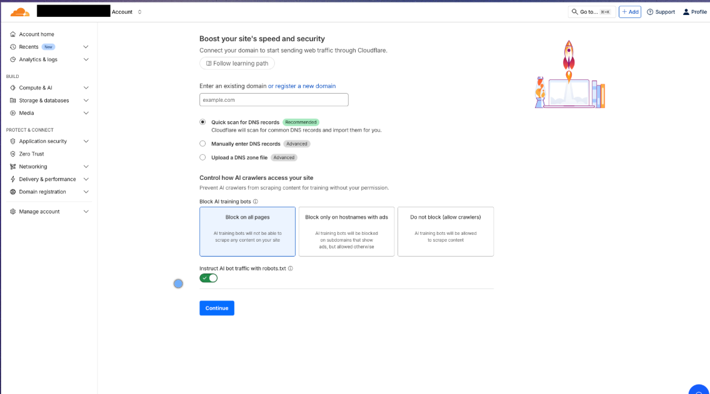
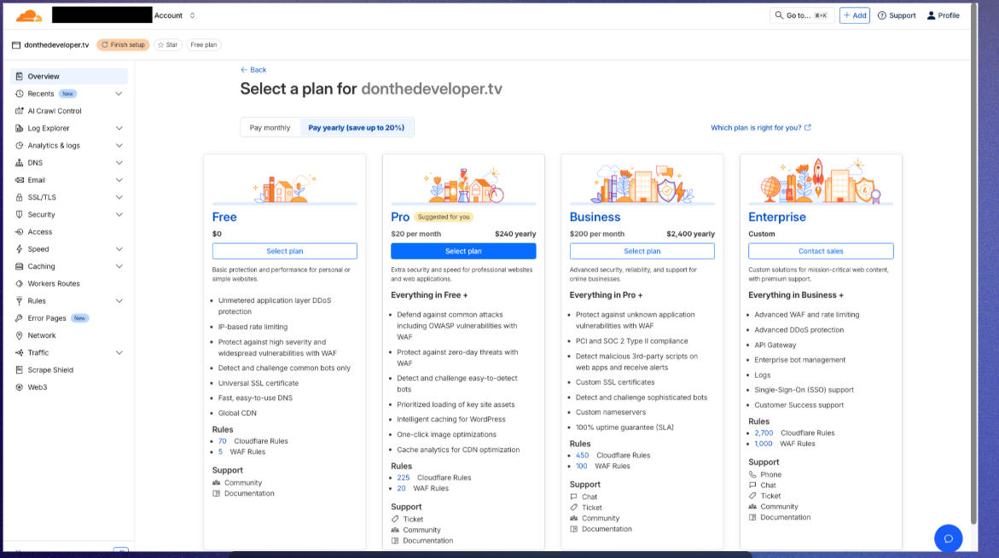
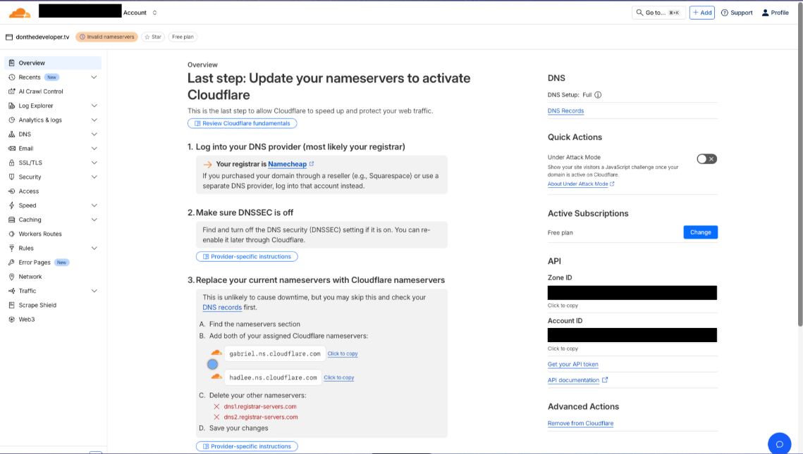
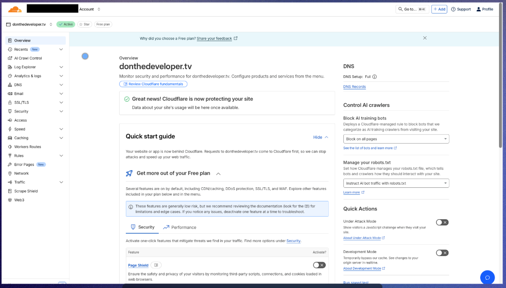
> some important cloudflare 

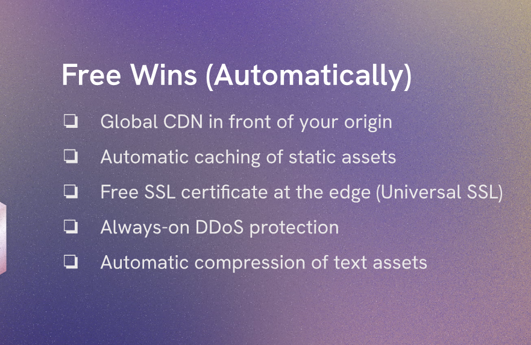

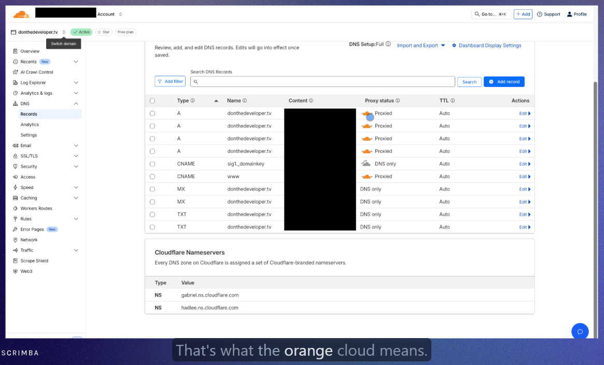

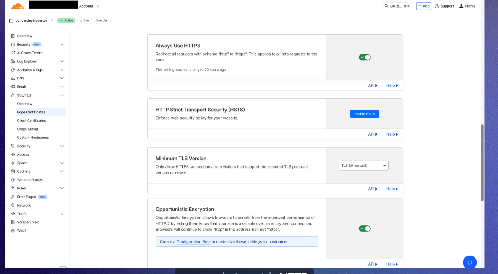