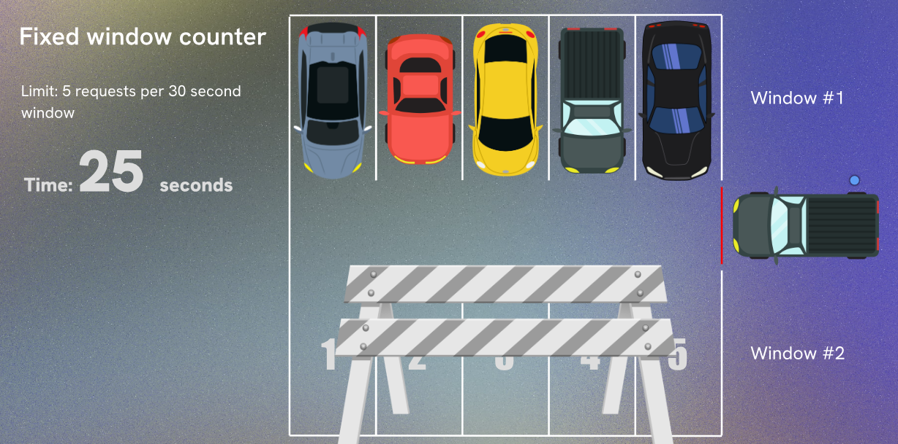

# Rate Limiting 
- Rate limiting is a technique used to control the amount of incoming and outgoing traffic to or from a network or application. It helps prevent abuse, overuse, and potential denial-of-service (DoS) attacks by limiting the number of requests a user or system can make within a specified time frame.

In a simple example, a web application might implement rate limiting to restrict users to a maximum of 100 requests per minute. If a user exceeds this limit, they may receive an error message or be temporarily blocked from making further requests.

There are several common methods for implementing rate limiting:
1. Fixed Window Counter: This method divides time into fixed intervals (e.g., 1 minute) and counts the number of requests made during each interval. If the count exceeds the limit, further requests are blocked until the next interval.

> Window boundaries can lead to uneven distribution of requests, as a user could make a burst of requests at the end of one window and the beginning of the next.

2. Sliding Window Log: This method keeps a log of timestamps for each request and allows requests as long as the number of requests within a sliding time window (e.g., the last 1 minute) does not exceed the limit.
3. Token Bucket: This method uses a "bucket" of tokens that are replenished at a fixed rate. Each request consumes a token, and if there are no tokens left, the request is denied.     
4. Leaky Bucket: This method processes requests at a fixed rate, allowing bursts of traffic up to a certain limit. Excess requests are queued and processed as capacity allows.

5. User-Based Rate Limiting: This method applies rate limits based on individual user accounts or IP addresses, allowing for more granular control over traffic.

6. API Key-Based Rate Limiting: This method uses API keys to identify and limit requests from different clients or applications.

7. Dynamic Rate Limiting: This method adjusts rate limits based on current server load or traffic patterns, allowing for more flexibility during peak times.

8. Geographical Rate Limiting: This method applies different rate limits based on the geographical location of the user, which can help mitigate region-specific attacks.

9. Distributed Rate Limiting: This method implements rate limiting across multiple servers or instances, ensuring consistent enforcement of limits in a distributed environment.

10. Hybrid Approaches: This method combines multiple rate limiting techniques to achieve more effective traffic control and protection against various types of attacks.

11. Response Headers: This method includes rate limit information in response headers, allowing clients to understand their current usage and limits.
Implementing rate limiting is crucial for maintaining the performance, reliability, and security of web applications and

12. services. It helps protect against abuse, ensures fair usage, and mitigates the risk of denial-of-service attacks.

13. Monitoring and Logging: This method involves tracking rate limit violations and logging them for analysis, which can help identify potential abuse patterns and inform future rate limiting strategies.
