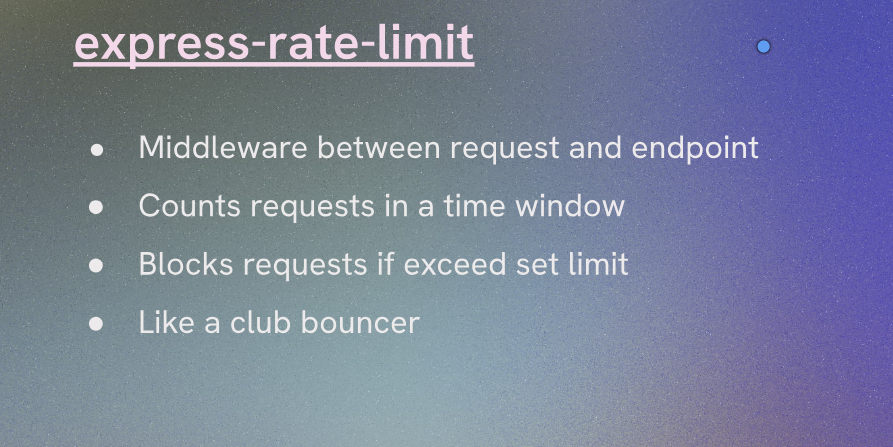
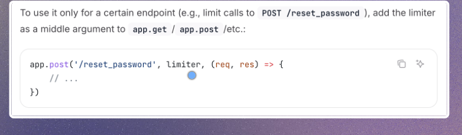

https://express-rate-limit.mintlify.app/overview


npm install express-rate-limit

whats is it?
Express Rate Limit is a middleware for Express.js applications that helps to limit repeated requests to public APIs

# Features
- Easy to use and integrate with Express.js applications.
- Configurable options for customizing rate limiting behavior.
- Supports various storage options for tracking request counts, including in-memory, Redis, and more.

rate limiting example in express.js
```javascript
const express = require('express');
const rateLimit = require('express-rate-limit');

```
