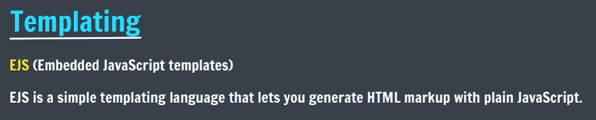
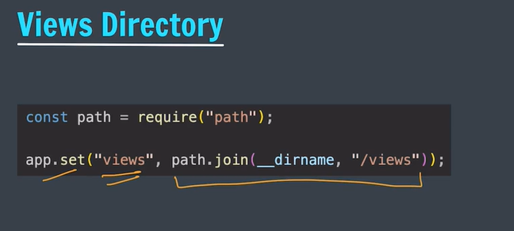
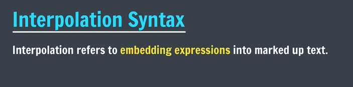
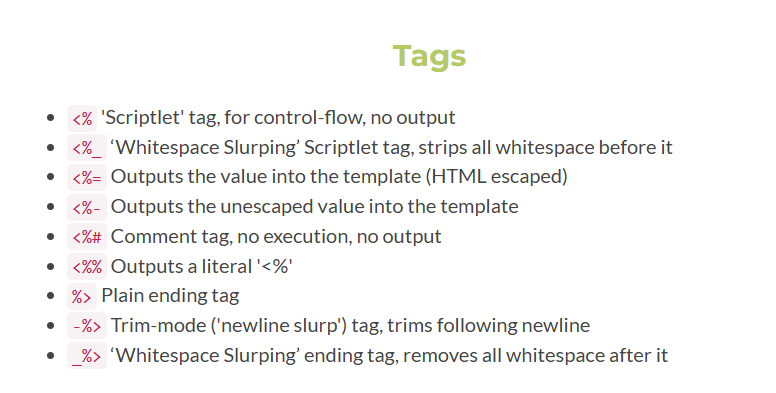
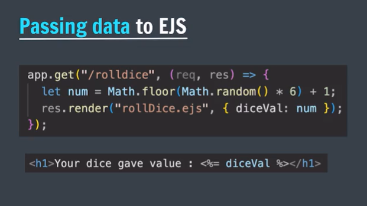
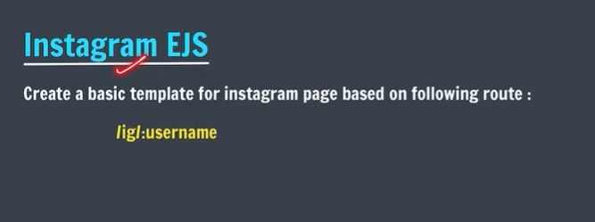
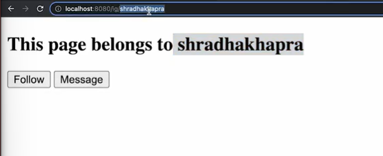
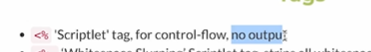
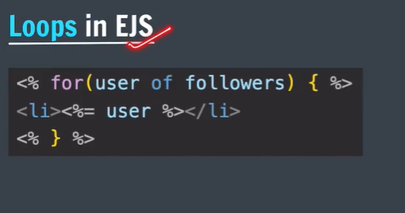

# We are Starting with understanding Templating first:
- Templates are fixed layout that we often use to display dynamic data.


Here as you can see we have 2 instagram pages where the layout is same but the data is different, so Templates are like *blueprints*.

cause there can be 1000s of users but the layout of the page will remain same and we do not have to create separate HTML files for each user.

- Templating engines help us to create HTML pages dynamically by using static template files.

=> Some popular templating engines are:
  - EJS
  - Pug
  - Handlebars

- Here we will be using EJS as our templating engine.
- Why EJS?
  - Easy to learn
  - Simple syntax
  - Allows us to write plain JavaScript code inside HTML files.
  - Supports partials and layouts for reusability.

Lets see how to set up EJS in an Express application.
1. First, we need to install EJS using npm.
```bash
npm install ejs

```
2. Next, we need to set EJS as the templating engine in our Express app.


=> Views Directory: By default, Express looks for templates in a folder named 'views'. We can change this by setting the 'views' property.


views = path.join(__dirname, 'myviews');

__ = index.js __ current working directory
dirname = directory name
myviews = custom folder name



=> Interpolation Syntax:
- EJS uses `<%= %>` for outputting values and `<% %>` for control flow statements.

variables embedded in ejs using js
we can make dynamic webpages using ejs


https://ejs.co/

=> Lets learn about passing data to EJS templates.

- We can pass data to EJS templates using the `render` method.


What we learnt so far:
- What is Templating
- Popular Templating Engines like EJS
- Views Directory
- Interpolation Syntax in EJS
- Passing Data to EJS Templates

---
Now Lets make Instagram Profile Page using EJS Templating Engine.





=> Now lets use control flow statements in EJS to display posts dynamically.
- Scriptlet Tags: We can use `<% %>` to write JavaScript code like loops and conditionals inside EJS templates.





=> Partials in EJS:
- Partials are reusable components that can be included in multiple templates.


