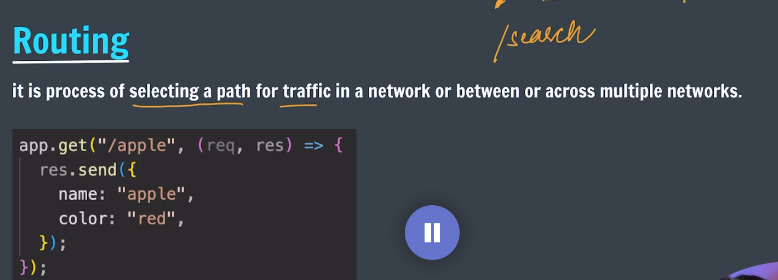

generally website have multiple routes or endpoints that users can access. Each route corresponds to a specific URL path and is associated with a particular functionality or resource on the website.

e.g amazon.com/electronics
     amazon.com/fashion
     amazon.com/grocery
     
and by default / is home route

In Express.js, routing is the mechanism that allows you to define how your application responds to different HTTP requests made to specific URL paths. You can create routes for various HTTP methods (GET, POST, PUT, DELETE, etc.) and associate them with specific URL patterns.