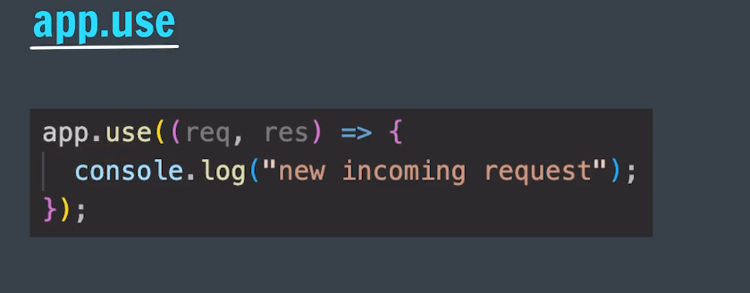
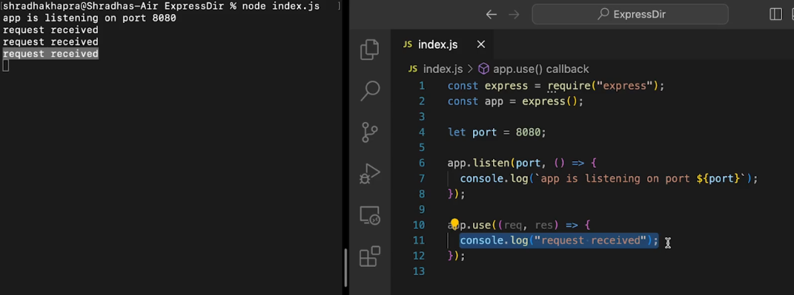
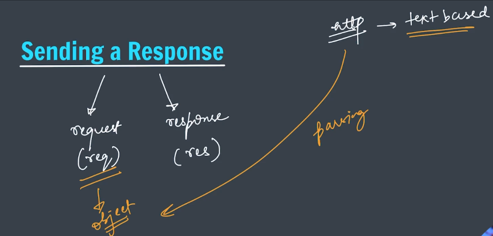

Handling requests and responses using Express.js

Here is response way

for sending response : 
1. request : express make text based request to object based that comes from http

2. response: for sending response we send respond object response.send("Hello from Express.js")

by default express change object to json format

