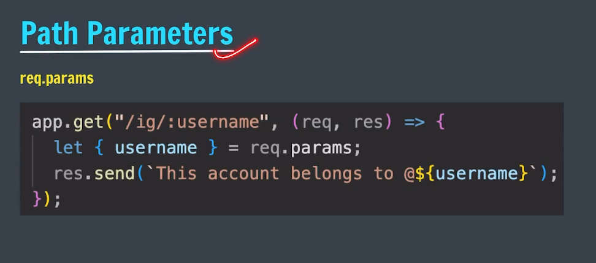
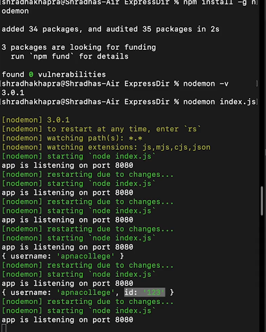
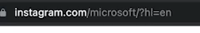
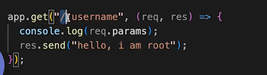
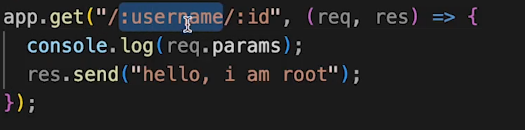
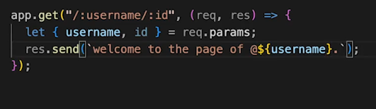
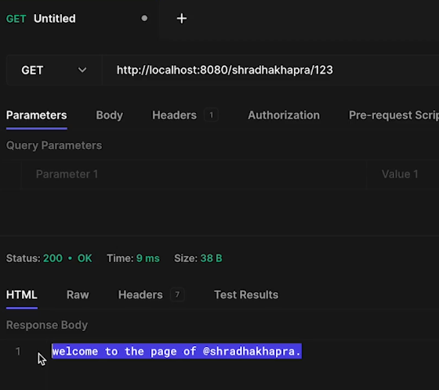
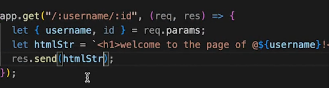
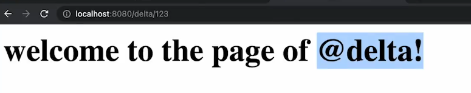

Generally instagram or any website uses this for storing new user details or any other details.

using path parameters we can capture values specified at their position in the URL.

e.g in instagram.com/user/kumud
or instagram.com/user/kumud/123

here kumud and 123 are path parameters.
where kumud can be username and
123 can be user id.

for username

for username and id

for seeing username and request

