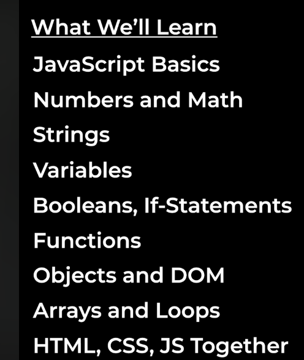
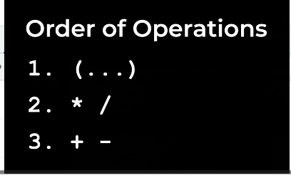
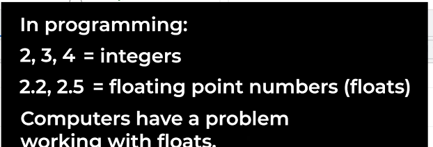
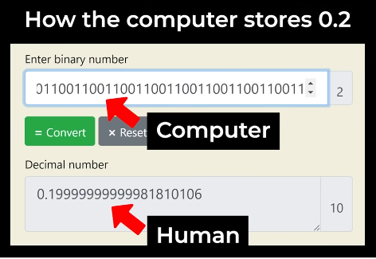
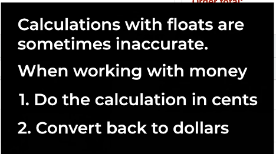

# javascript
## when we talk about Website development
- Html is a markup language that we mainly use for creating content of the websites like button, text all the images
- css use for styling the website looks and feels and also effects
- Javascript is a programming language that use for modification/interactions on them.
-------------------------------------------------------------------
## we will cover these things


-------------------------------------------------------------------
**javascript basic**
= after opening inspect on chrome ctrl + shift + i
run these commands

```
-- alert('Hello') // use for popup message on screen
-- prompt("enter a number") // use for taking input from user
-- console.log("print number in console")
-- document.body.innerHTML = 'Hello';
-- 20-5 
-- 20+5

```
**Numbers**
> write code to test
> adding, sub, multiply, division
`
10-3= 7
10 +3 = 13
10 * 5 = 15
10 /5 = 2

`
> now test these things
`
- 10*3+2 = 30+2=32 
- 2+10*3 = 30+2=32 // order of operation (priority basis * and / have same priority and +/- after that )
- (2+10) * 3 = 15

- 
`
>Integers and Float


- 0.1 + 0.2 = 0.30000000000000004
- 
- 
- 
- 20.95 + 7.99 = 28.93999999998 but we want 28.94 exact number but its not gonna happen cause of issue
- cause floating point is inaccurate in computers thats why we can use this way
- 

> lets run new features
- Math.round(2.8)
-- ans: 3