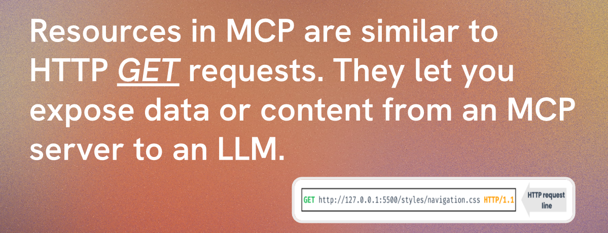
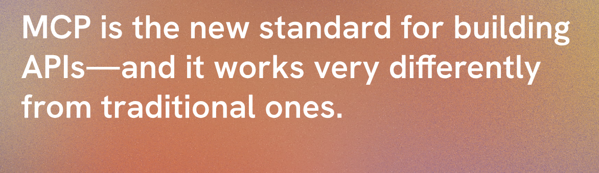
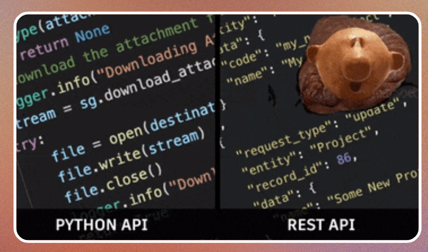
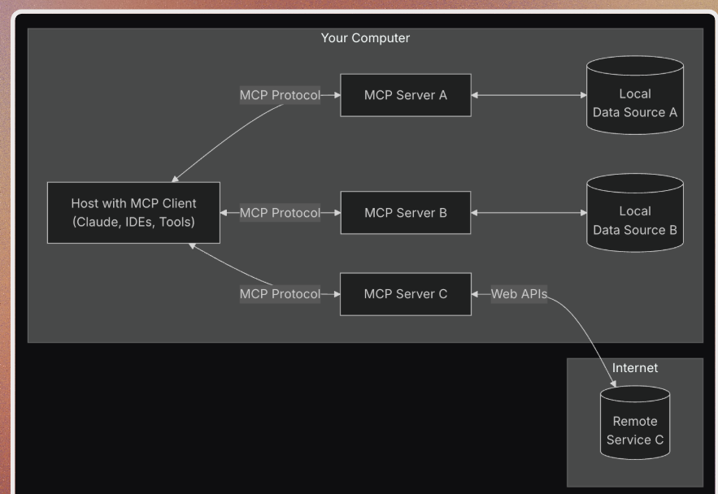
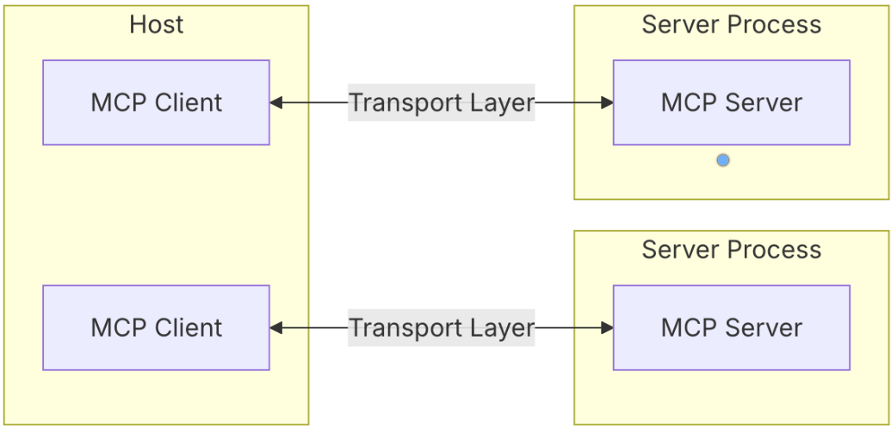
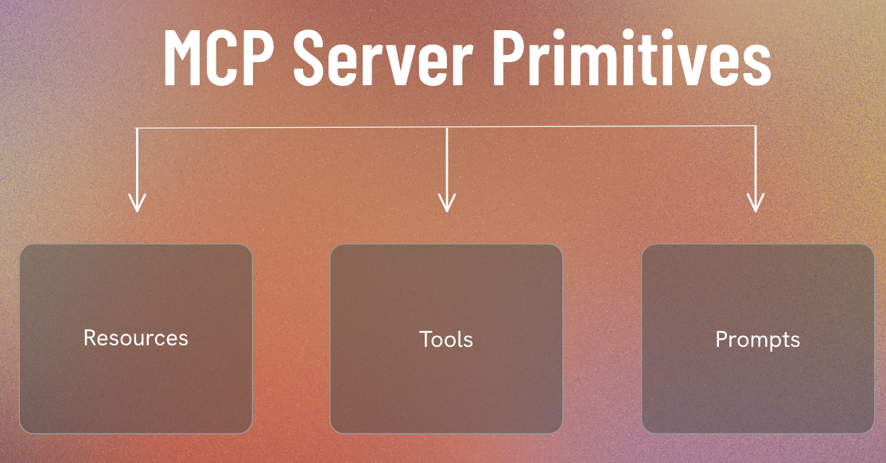
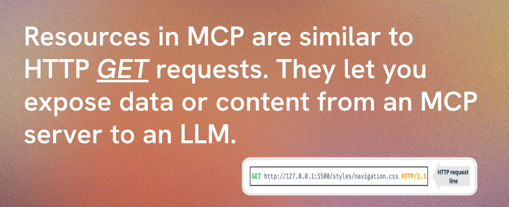
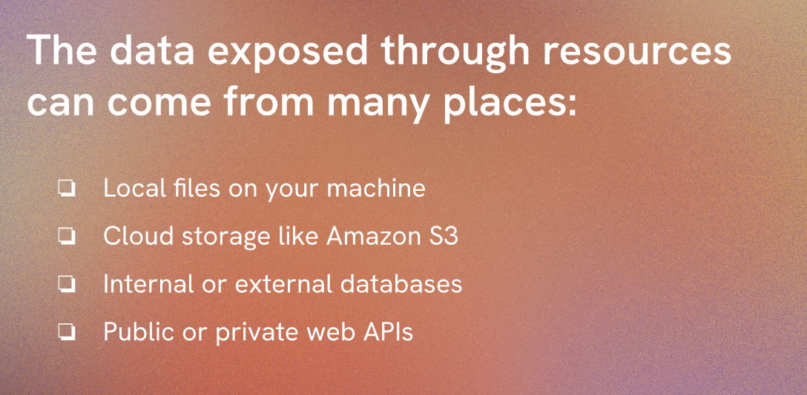
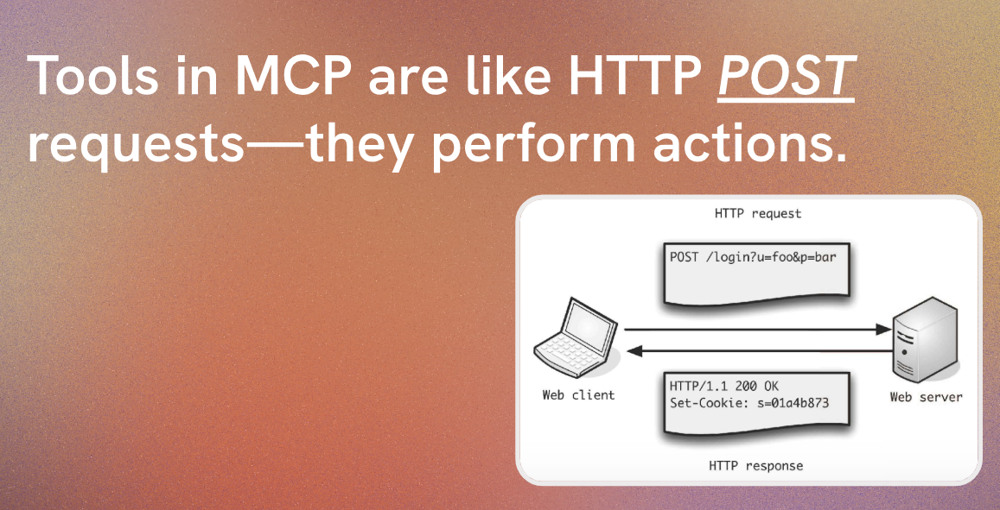
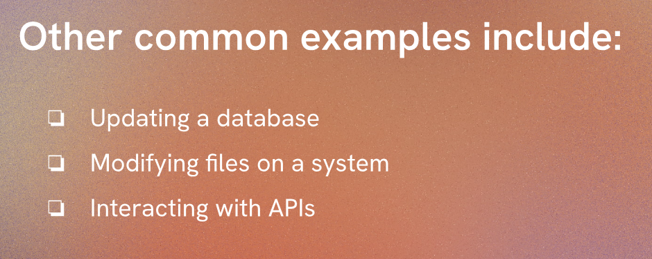

# MCP 
- Lets learn about MCP here.
- Model Context Protocol (MCP) is a framework used to define and manage the context and protocols for various systems and applications. It provides a structured approach to modeling the interactions, data flows, and security requirements of different components within a system.

- MCP helps in identifying potential security risks and vulnerabilities by analyzing the context in which different components operate. It allows developers and security professionals to create comprehensive models that capture the relationships between various elements, such as users, devices, networks, and applications.

back days we were using python and rest api for building api but now we are using MCP for building api.

