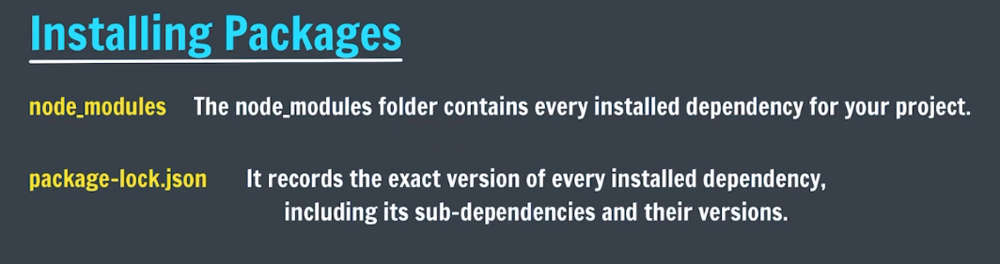
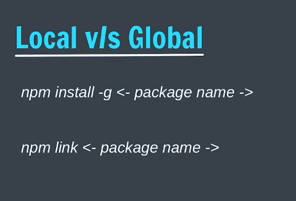
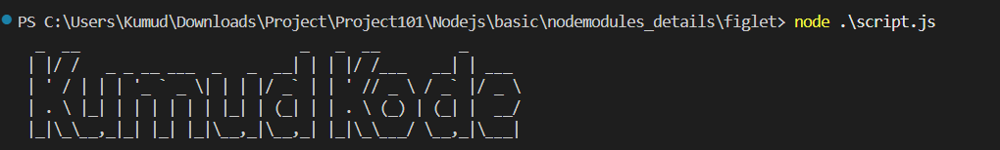
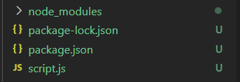

we install the figlet module using the npm install figlet command. This creates a node_modules folder in our project directory that contains the figlet module and its dependencies.





- node modules is a folder that contains all the installed npm packages for a Node.js project. When you install a package using npm, it gets downloaded and stored in the node_modules folder.

- packages.json is a file that contains metadata about the project, including its dependencies. It lists all the packages that the project depends on, along with their versions.

- package-lock.json is a file that is automatically generated when you install packages using npm. It contains a detailed description of the exact version of each package that was installed, along with its dependencies. This file ensures that the same versions of packages are installed when the project is set up on different machines or environments.


// lets make our own module
Here are the steps to create and use a custom module in Node.js:
1. Create a new file named math.js in your project directory.
2. In math.js, define the functions or variables that you want to export. For example:

```javascript
// math.js
const PI = 3.14;
const number = 42;
function add(a, b) {
    return a + b;
}
module.exports = { PI, number, add };
```
3. In another file (e.g., app.js), import the custom module using the require function. For example:

```javascript
// app.js
const someMath = require('./math');
console.log("Addition: ", someMath.add(5, 10));
console.log("Number: ", someMath.number);
console.log("PI: ", someMath.PI);
```


