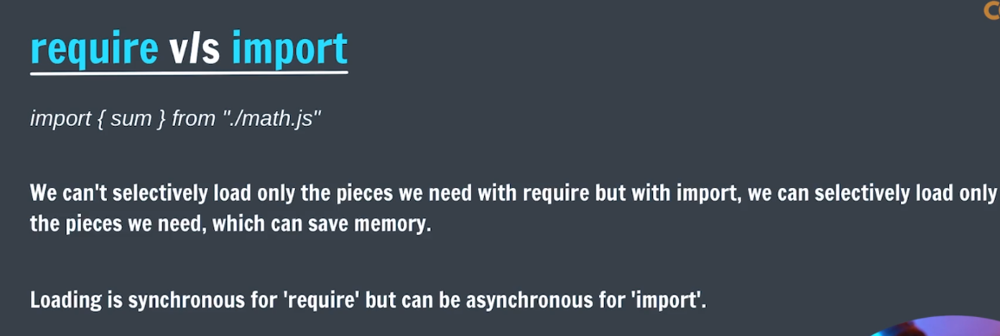

require and import are both used to include modules in Node.js, but they have some differences:

Lets see about require:
1. require is a CommonJS module system used in Node.js.
2. It is synchronous, meaning that the module is loaded and executed before the next line of code is executed.
3. It uses the require() function to load modules.
4. Example:
   const fs = require('fs');
    const path = require('path');
Lets see about import:
1. import is an ES6 module system that is also supported in Node.js (with some configuration).
2. It is asynchronous, meaning that the module can be loaded in the background while the rest of the code continues to execute.     
3. It uses the import statement to load modules.
4. Example:
   import fs from 'fs';
   import path from 'path';

   
In summary, require is the traditional way of loading modules in Node.js, while import is a newer syntax that is part of the ES6 standard. The choice between the two depends on the specific use case and the module system being used in the project.
