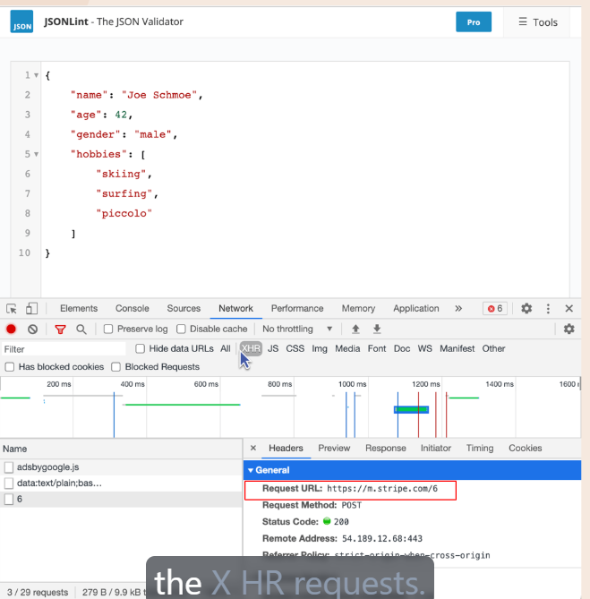
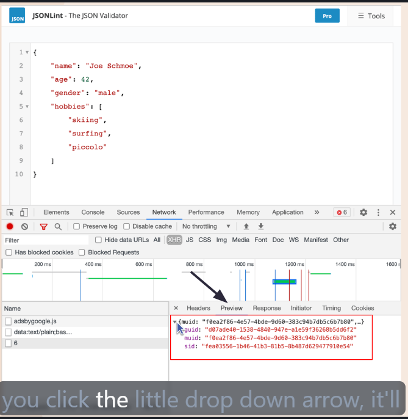

# JSON javascript object Notation
JSON (JavaScript Object Notation) is a lightweight data-interchange format that is easy for humans to read and write, and easy for machines to parse and generate. It is commonly used for transmitting data in web applications between a server and a client.

## JSON Structure
JSON is built on two structures:
1. A collection of name/value pairs (often referred to as an object)

[JsonLint Link](https://jsonlint.com/)
use for json validator if you think your json file isnt correct


XHR request are those request in which AJX we get as JSON response
  ```
  - XMLHttpRequest (XHR) requests are a fundamental component of Asynchronous JavaScript and XML (AJAX) for making HTTP requests from a web browser. While XHR can handle various data formats, including XML, HTML, and plain text, it is commonly used to receive JSON (JavaScript Object Notation) responses from the server.

  - XHR requests are the mechanism used within AJAX to communicate with a server, and receiving a JSON response is a frequent and efficient way to exchange data in this process
  ```



## URL and ENDPOINTS
- URL (Uniform Resource Locator) is the address used to access resources on the internet. It specifies the location of a resource and the protocol used to access it (e.g., HTTP, HTTPS).

- An endpoint is a specific URL where an API can be accessed by a client application. It represents a specific function or resource provided by the API.

## Example of JSON data from an API endpoint
- Whenever we have to use endpoints on API we added them on base URL 

/* Base URL */
https://apis.scrimba.com/dog.ceo/api

/* Endpoints */
/breeds/list/all
/breeds/image/random

- Full URL with Endpoint
- Dog CEO API
=> https://apis.scrimba.com/dog.ceo/api/breeds/list/all