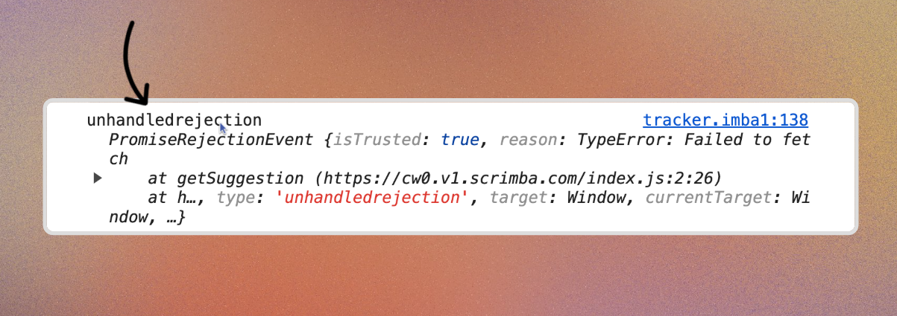

# promises
A Promise is an object representing the eventual completion or failure of an asynchronous operation.
> Promises have three states:
1. Pending: The initial state, neither fulfilled nor rejected.
2. Resolved/ Fulfilled: The operation completed successfully.
3. Rejected: The operation failed.

> Example of promises:
- Imagine you went to a job interview and there they say that like, hey you thanks for giving interview and we will let you know after sometimes

- Here They promises that they let u know (so its pending state) cause u still do not know either selected or rejected

- After some days they call you and say you are selected or rejected but cause they promises you that they call so that promise is fulfilled

- Then there is reject state where they did not inform you


## Why use Promises?
- In JavaScript, Promises are used to handle asynchronous operations, such as fetching data from an API, reading files, or performing time-consuming tasks without blocking the main thread.

- Promises provide a cleaner and more manageable way to work with asynchronous code compared to traditional callback functions, allowing developers to chain operations and handle errors more effectively.

## Creating a Promise
```javascript
const myPromise = new Promise((resolve, reject) => {
  // Simulating an asynchronous operation
  setTimeout(() => {
    const success = true; // Change this to false to simulate failure
    if (success) {
      resolve("Operation completed successfully!");
    } else {
      reject("Operation failed.");
    }
  }, 2000);
});
```
