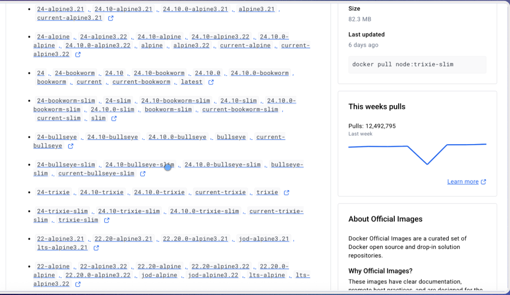
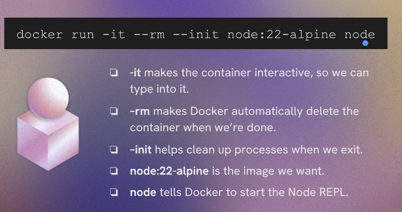
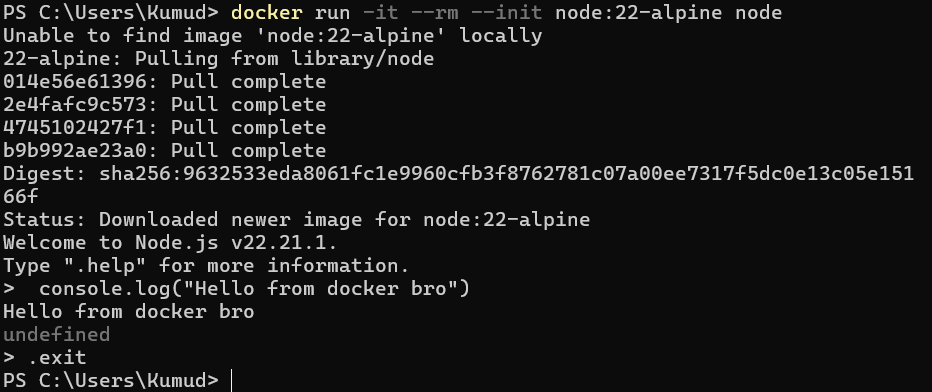
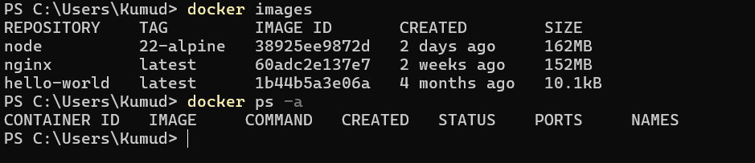
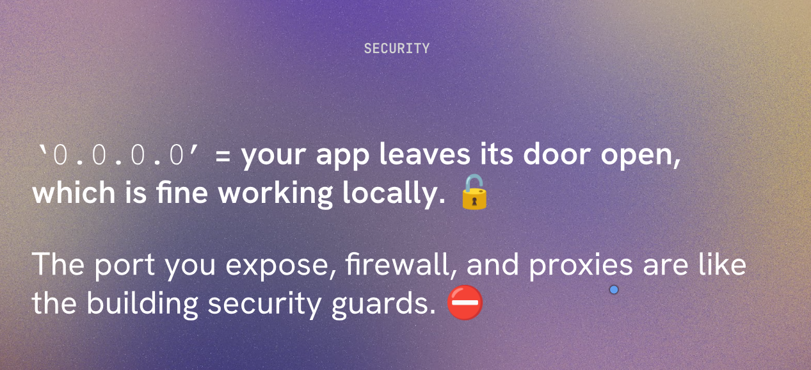
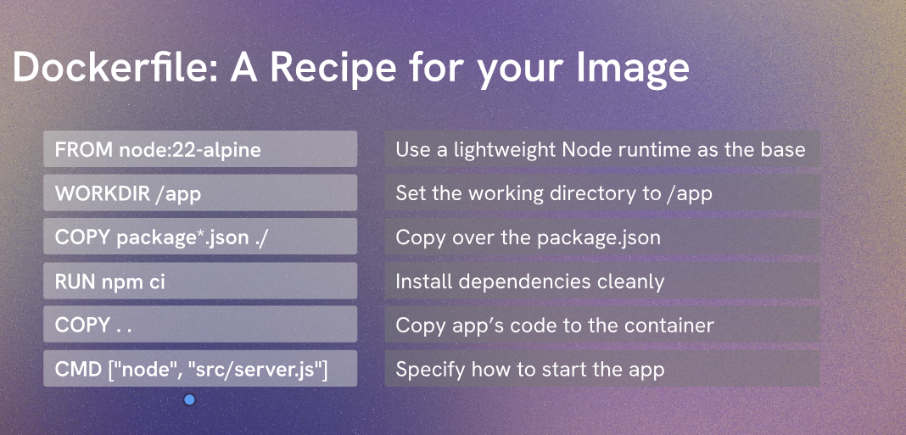

# Run node in Docker
To build and run a Node.js application in a Docker container, follow these steps:
1. Build the Docker image:
   ```bash
   docker build -t your-node-app .
   ```
2. Run the Docker container:
   ```bash
    docker run -d -p 3000:3000 your-node-app
    ```
3. (Optional) Use Docker Compose to manage multi-container setups:
    ```bash
    docker-compose up -d
    ```
## Notes

- Use alpine and slim for better performance and small size
- for running node alpine
```
docker run -it --rm --init node:22-alpine node
details here:


```
> Challenge:
1. Run "docker run -it --rm --init node:22-alpine node"
2. From the node REPL, log "Hello from Docker!"
3. Exit the REPL by typing ".exit".
4. Check the images you have locally stored by using the "images" command.
5. Check that the container was automatically removed.

output


output automatically cleaned up cause of --rm


---
> story of 0 0 0 0 
- using 4 zeros you can have access to outside environment and device can communicate with each other


- for example if you have a web server running inside docker container and you want to access it from outside you can bind the port using -p flag like this
```


```


