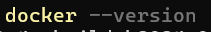
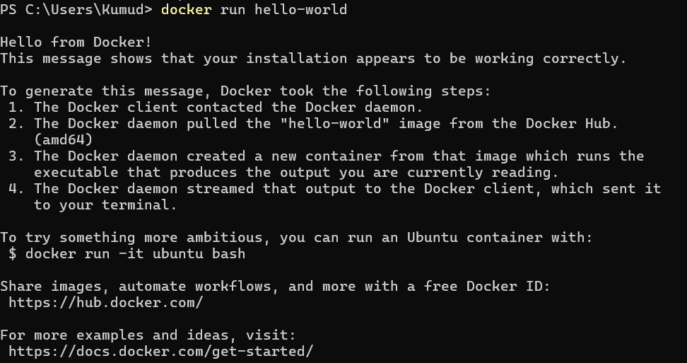
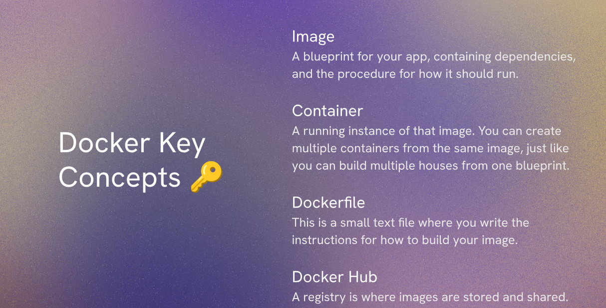
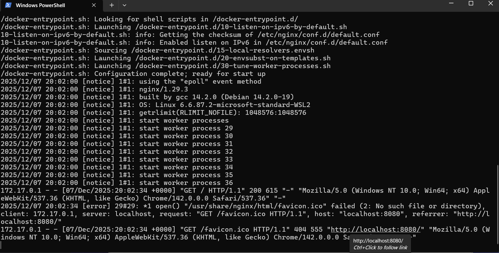
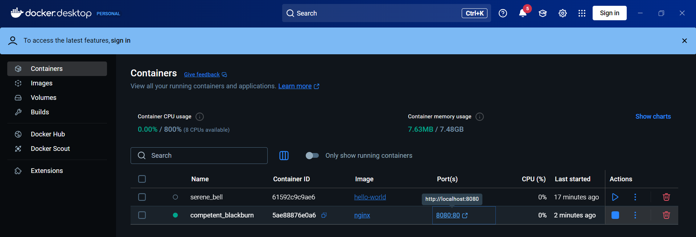
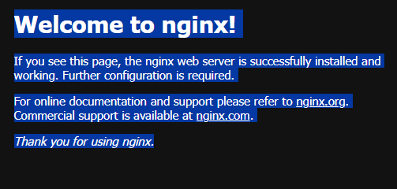
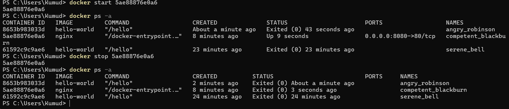

# docker 
This directory contains Docker-related files and configurations for containerizing the application.
## Contents
- `Dockerfile`: Instructions to build the Docker image for the application.
- `docker-compose.yml`: Configuration file for Docker Compose to set up multi-container Docker applications.
- `entrypoint.sh`: A shell script that serves as the entry point for the Docker container.
## Usage
To build and run the Docker container, follow these steps:
1. Build the Docker image:
   ```bash
   docker build -t your-image-name .
   ```
2. Run the Docker container:
   ```bash
    docker run -d -p 8080:8080 your-image-name
    ```
3. (Optional) Use Docker Compose to manage multi-container setups:
    ```bash
    docker-compose up -d
    ```
## Notes
- Ensure that Docker is installed and running on your machine before executing the above commands.
- Modify the `Dockerfile` and `docker-compose.yml` as needed to fit your application's requirements.
- The `entrypoint.sh` script may need executable permissions. You can set this with:
   ```bash
   chmod +x entrypoint.sh
   ```
- Customize environment variables and configurations in the `docker-compose.yml` file as necessary.
## Additional Resources
- [Docker Documentation](https://docs.docker.com/)
- [Docker Compose Documentation](https://docs.docker.com/compose/)
- [Download Docker](https://www.docker.com/products/docker-desktop/)
--- 
---



This image demonstrates a successful Docker installation by running the `hello-world` container.



> whats the docker Image?

- Docker image concept
  -- Reusable (Create containers again and again)
  -- Immutable (if you need update you build a new one)

> Challenge:

1. Run "docker run -p 8080:80 nginx" in the terminal on your machine. 
2. Open your browser and navigate to localhost:8080.

If port 8080 is busy, choose a different port like 3000 or 5000.

output 




> commands
- `docker ps` : List running containers
- `docker ps -a` : List all containers (running and stopped)
- `docker start <container_id>` : start a stopped container

- `docker stop <container_id>` : Stop a running container
- `docker rm <container_id>` : Remove a stopped container
